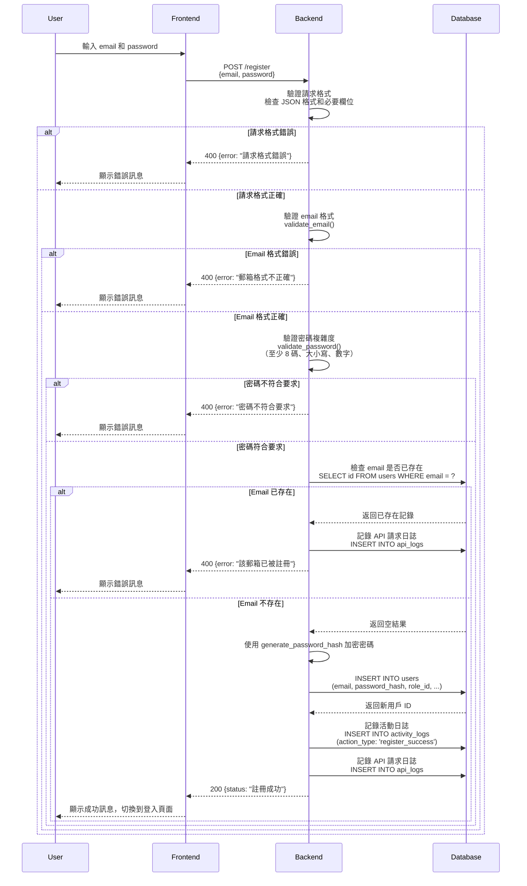
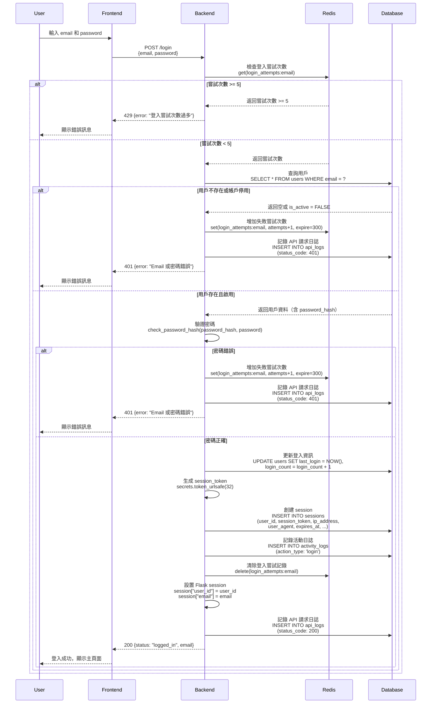
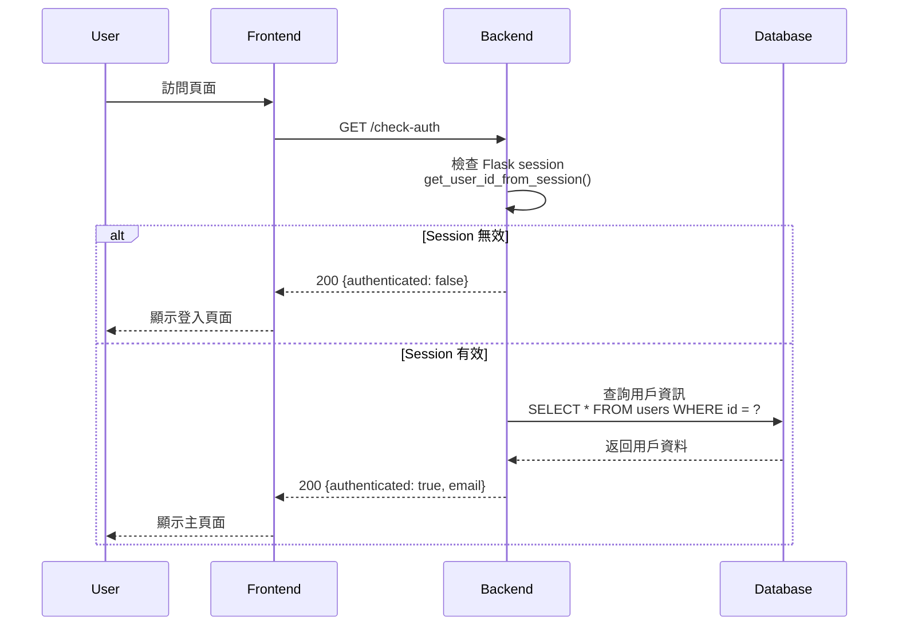
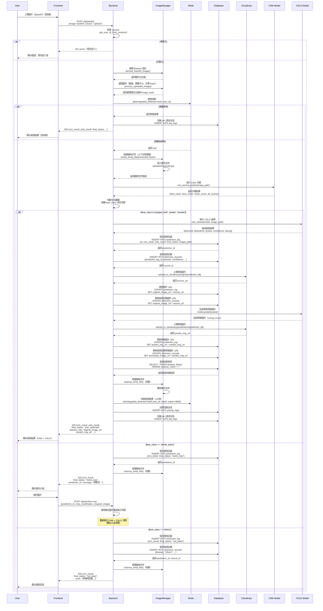
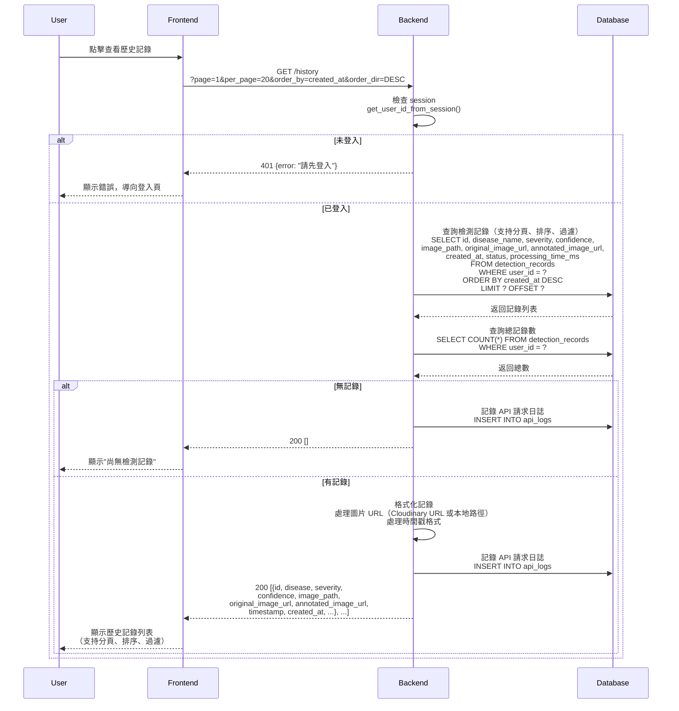
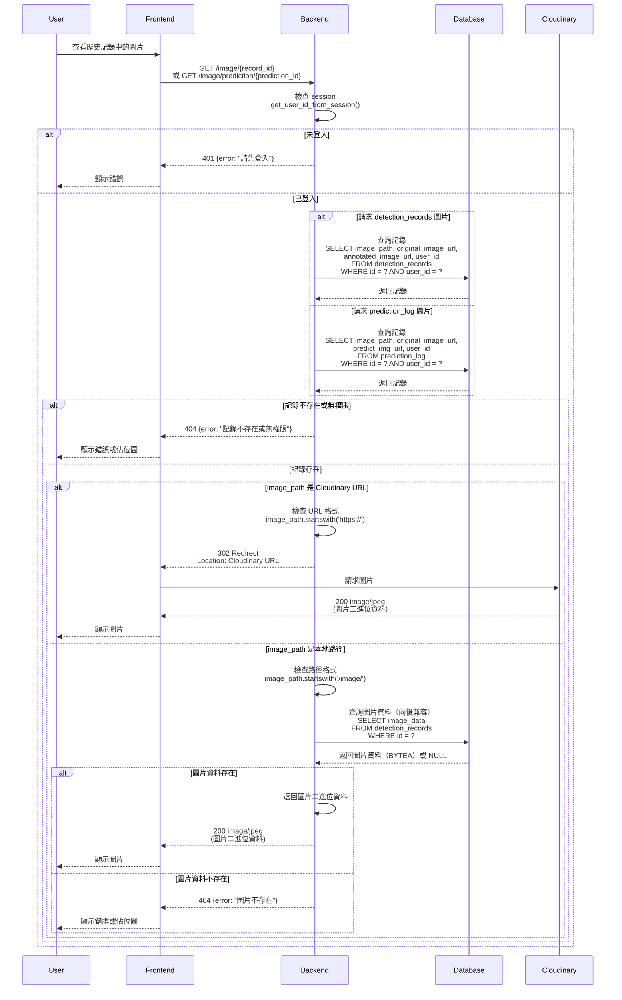
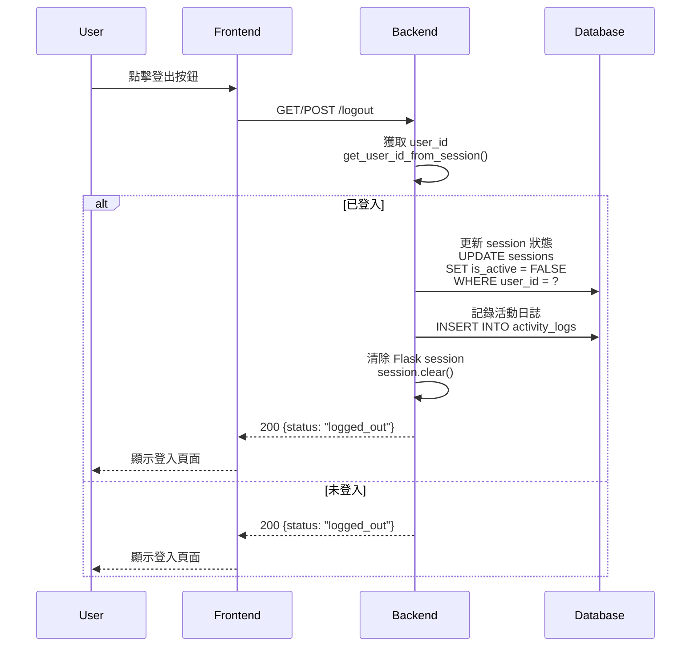
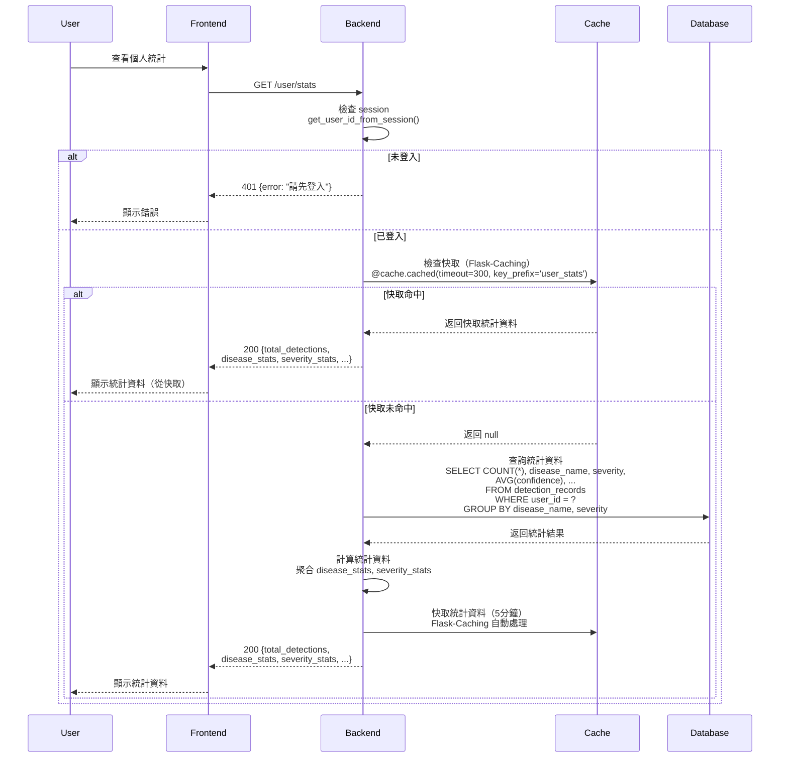

# Leaf Disease AI - Sequence Diagrams

本文檔使用 Mermaid 格式描述系統的主要流程序列圖。

## 角色說明

-   **User**: 使用者
-   **Frontend**: React 前端應用
-   **Backend**: Flask 後端服務
-   **ImageManager**: 圖片管理服務（處理圖片解碼、處理、臨時文件、Cloudinary 上傳）
-   **Database**: PostgreSQL 資料庫
-   **Cloudinary**: 雲端圖片存儲服務（可選，如果啟用）
-   **CNN Model**: CNN 分類模型（MobileNetV3）
-   **YOLO Model**: YOLOv11 病害檢測模型
-   **Redis**: Redis 快取服務（用於登入嘗試限制和檢測結果快取）
-   **Cache**: Flask-Caching（用於使用者統計快取）

---

## 1. 使用者註冊 (Register)

---

## 2. 使用者登入 (Login)

---

## 3. 檢查認證狀態 (Check Auth)

---

## 4. 整合檢測流程 (CNN + YOLO)

---

## 5. 獲取檢測歷史 (History)

---

## 6. 獲取圖片 (Get Image)

---

## 7. 使用者登出 (Logout)

---

## 8. 獲取使用者統計 (User Stats)

---

## 注意事項

### Redis 快取策略

1. **登入嘗試限制**: `login_attempts:{email}` - 5 分鐘過期
2. **檢測結果快取**: `integrated_detection:{image_hash}:{user_id}` - 1 小時過期
3. **使用者統計快取**: Flask-Caching (`@cache.cached`) - 5 分鐘過期

### 錯誤處理

-   所有 API 請求都會記錄到 `api_logs` 表
-   認證錯誤會記錄到 `error_logs` 表
-   使用者活動會記錄到 `activity_logs` 表

### 圖片存儲

-   上傳的圖片會先暫存到 `uploads/` 目錄（使用臨時文件）
-   檢測完成後，圖片會上傳到 Cloudinary（如果啟用）：
    -   原始圖片：`leaf_disease_ai/origin/{prediction_id}.jpg`
    -   帶檢測框圖片：`leaf_disease_ai/predictions/{prediction_id}.jpg`
-   資料庫中只存儲圖片 URL（`original_image_url`, `predict_img_url`, `annotated_image_url`）
-   臨時文件會在檢測完成後自動清理（使用上下文管理器）
-   圖片可通過以下端點獲取：
    -   `/image/{record_id}` - 獲取 detection_records 圖片
    -   `/image/prediction/{prediction_id}` - 獲取 prediction_log 圖片
    -   如果是 Cloudinary URL，會重定向到 Cloudinary
    -   如果是本地路徑，會從資料庫讀取（向後兼容）

### AI Model 整合

-   CNN 和 YOLOv11 模型在後端啟動時載入
-   CNN 分類流程：
    -   先執行 CNN 分類，獲取圖片類別（pepper_bell, potato, tomato, whole_plant, others）
    -   根據分類結果決定是否執行 YOLO 檢測
-   YOLO 檢測流程（僅在特定類別時執行）：
    -   調用 `yolo_detect(model, image_path)` 進行檢測
    -   使用 `model.predict().plot()` 生成帶檢測框的圖片
    -   預測結果包含：病害名稱、置信度、邊界框等資訊
-   整合檢測服務 (`IntegratedDetectionService`) 統一管理整個流程

### Cloudinary 圖片存儲

-   如果啟用 Cloudinary，所有圖片都會上傳到 Cloudinary 雲端存儲
-   圖片組織結構：
    -   `leaf_disease_ai/origin/{prediction_id}.jpg` - 原始圖片
    -   `leaf_disease_ai/predictions/{prediction_id}.jpg` - 帶檢測框的圖片
-   資料庫中只存儲 Cloudinary URL，不存儲圖片二進位資料
-   圖片訪問：
    -   通過 Cloudinary URL 直接訪問（CDN 加速）
    -   如果 Cloudinary 未啟用，則使用本地文件系統或資料庫存儲（向後兼容）
