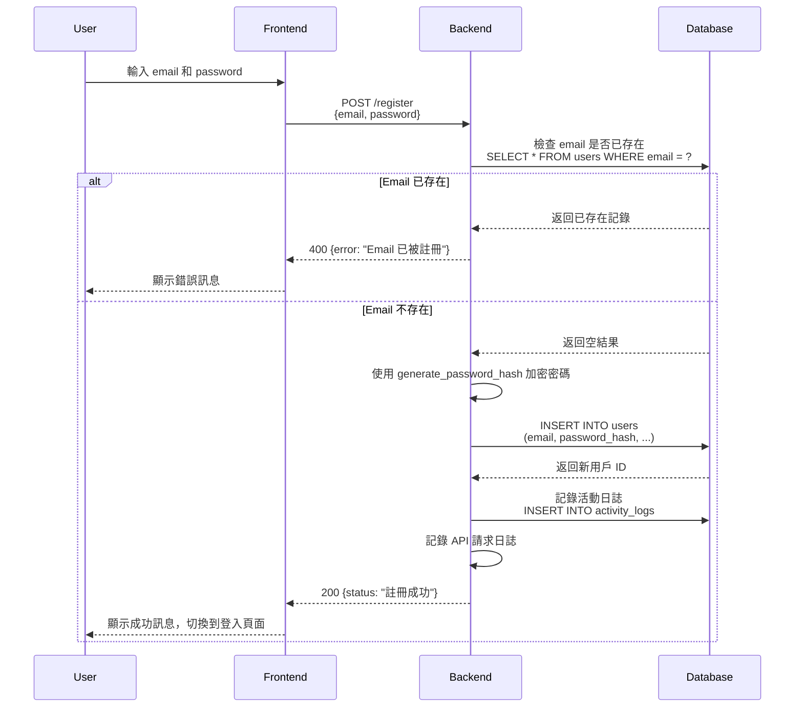
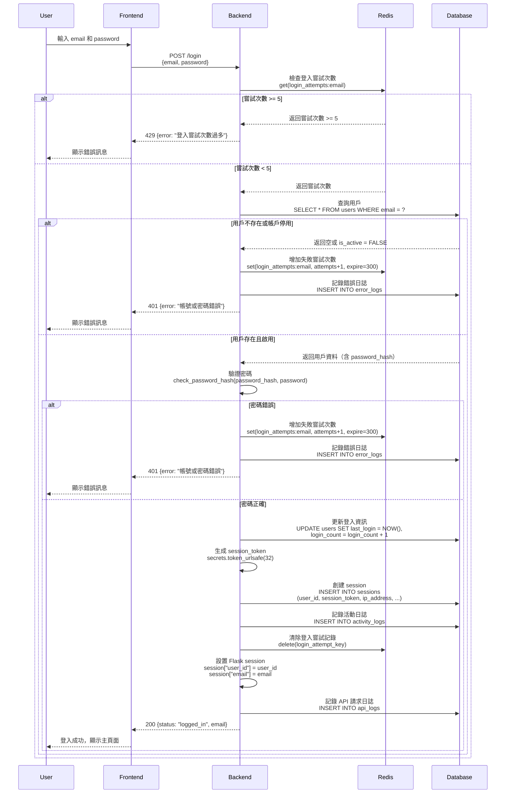
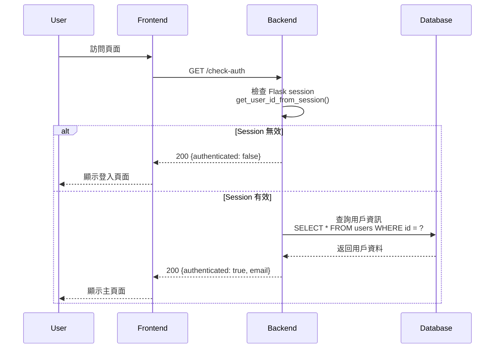
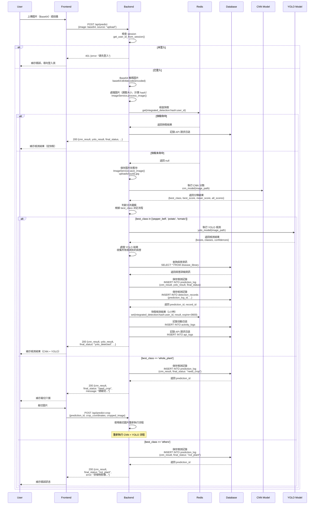
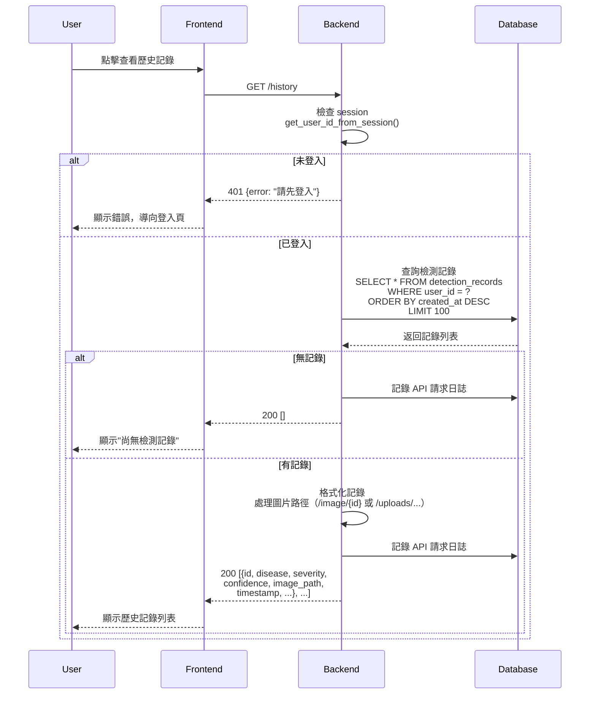
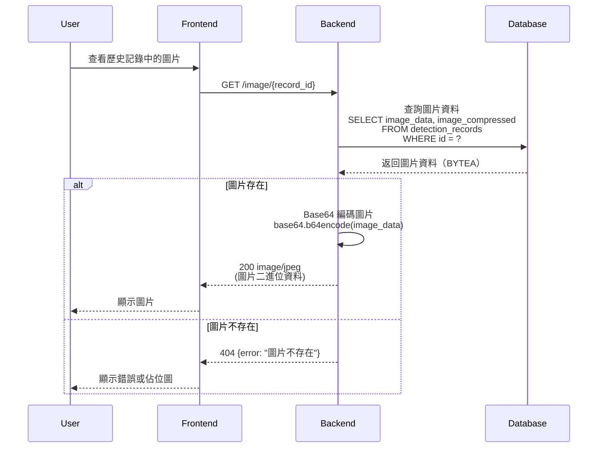
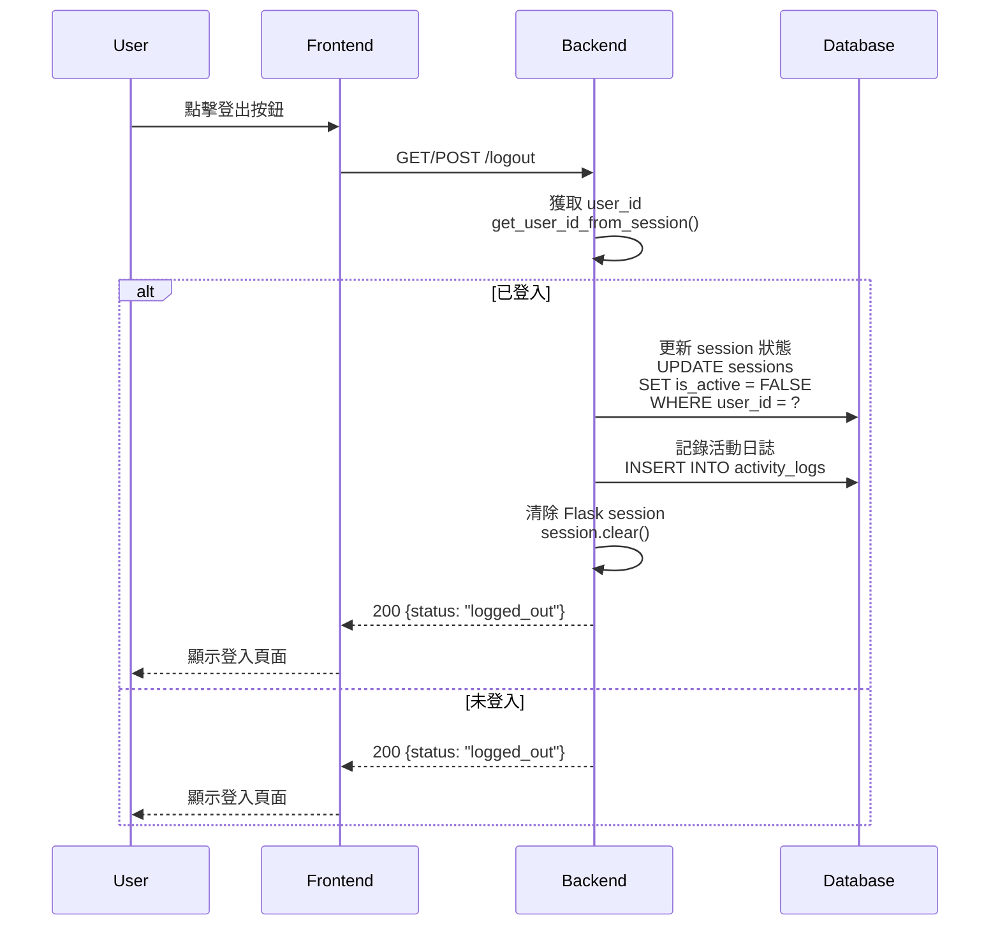
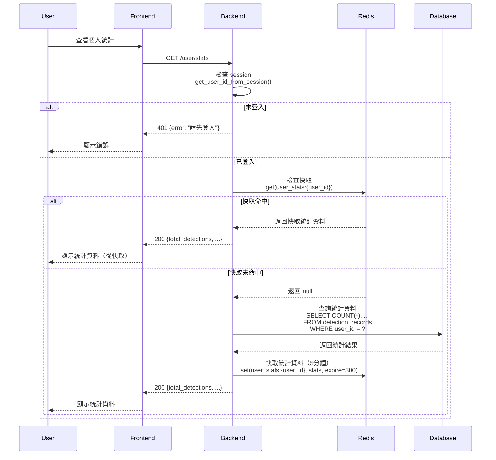

# Leaf Disease AI - Sequence Diagrams

本文檔使用 Mermaid 格式描述系統的主要流程序列圖。

## 角色說明

-   **User**: 使用者
-   **Frontend**: React 前端應用
-   **Backend**: Flask 後端服務
-   **Database**: PostgreSQL 資料庫
-   **AI Model**: YOLOv11 病害檢測模型
-   **Redis**: Redis 快取服務（可選）

---

## 1. 使用者註冊 (Register)

---

## 2. 使用者登入 (Login)

---

## 3. 檢查認證狀態 (Check Auth)

---

## 4. 整合檢測流程 (CNN + YOLO)

---

## 5. 獲取檢測歷史 (History)

---

## 6. 獲取圖片 (Get Image)

---

## 7. 使用者登出 (Logout)

---

## 8. 獲取使用者統計 (User Stats)

---

## 注意事項

### Redis 快取策略

1. **登入嘗試限制**: `login_attempts:{email}` - 5 分鐘過期
2. **檢測結果快取**: `detection_result:{image_hash}:{user_id}` - 1 小時過期
3. **使用者統計快取**: `user_stats:{user_id}` - 5 分鐘過期

### 錯誤處理

-   所有 API 請求都會記錄到 `api_logs` 表
-   認證錯誤會記錄到 `error_logs` 表
-   使用者活動會記錄到 `activity_logs` 表

### 圖片存儲

-   上傳的圖片會先暫存到 `uploads/` 目錄
-   檢測完成後，壓縮圖片會存儲到資料庫的 `detection_records.image_data` (BYTEA)
-   原始暫存檔案會在成功存儲後自動刪除
-   圖片可通過 `/image/{record_id}` 端點從資料庫讀取

### AI Model 整合

-   YOLOv11 模型在後端啟動時載入
-   每次檢測都會調用 `model(image_path)` 進行預測
-   預測結果包含：病害名稱、置信度、邊界框等資訊
