# Leaf Disease AI - Sequence Diagrams

本文檔使用 Mermaid 格式描述系統的主要流程序列圖。

## 角色說明

-   **User**: 使用者
-   **Frontend**: React 前端應用
-   **Backend**: Flask 後端服務
-   **ImageManager**: 圖片管理服務（處理圖片解碼、處理、臨時文件、Cloudinary 上傳）
-   **Database**: PostgreSQL 資料庫
-   **Cloudinary**: 雲端圖片存儲服務（可選，如果啟用）
-   **SR Model**: 超解析度模型（EDSR，可選，用於圖片預處理）
-   **CNN Model**: CNN 分類模型（MobileNetV3）
-   **YOLO Model**: YOLOv11 病害檢測模型
-   **Redis**: Redis 快取服務（用於登入嘗試限制和檢測結果快取）
-   **Cache**: Flask-Caching（用於使用者統計快取）

---

## 1. 使用者註冊 (Register)

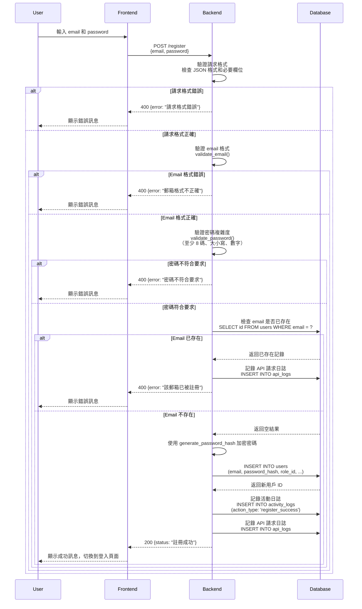

---

## 2. 使用者登入 (Login)

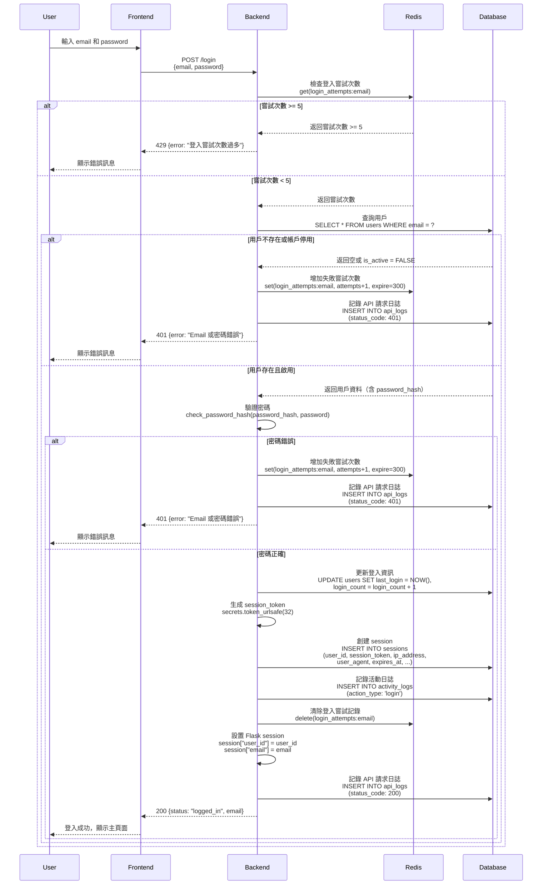

---

## 3. 檢查認證狀態 (Check Auth)

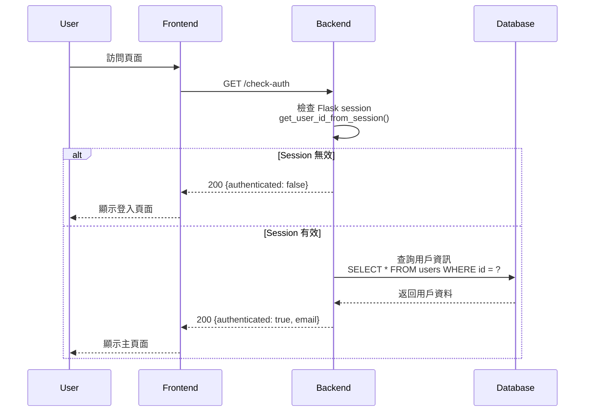

---

## 4. 整合檢測流程 (CNN + YOLO)

```mermaid
sequenceDiagram
    participant User
    participant Frontend
    participant Backend
    participant ImageManager
    participant Redis
    participant Database
    participant Cloudinary
    participant SR Model
    participant CNN Model
    participant YOLO Model

    User->>Frontend: 上傳圖片（Base64）或拍攝
    Frontend->>Backend: POST /api/predict<br/>{image: base64, source: "upload"}

    Backend->>Backend: 檢查 session<br/>get_user_id_from_session()

    alt 未登入
        Backend-->>Frontend: 401 {error: "請先登入"}
        Frontend-->>User: 顯示錯誤，導向登入頁
    else 已登入
        Backend->>ImageManager: 解碼 Base64 圖片<br/>decode_base64_image()
        ImageManager-->>Backend: 返回圖片位元組

        Backend->>ImageManager: 處理圖片（驗證、調整大小、計算 hash）<br/>process_uploaded_image()
        ImageManager-->>Backend: 返回處理後位元組和 image_hash

        Backend->>Redis: 檢查快取<br/>get(integrated_detection:hash:user_id)

        alt 快取命中
            Redis-->>Backend: 返回快取結果
            Backend->>Database: 記錄 API 請求日誌<br/>INSERT INTO api_logs
            Backend-->>Frontend: 200 {cnn_result, yolo_result, final_status, ...}
            Frontend-->>User: 顯示檢測結果（從快取）
        else 快取未命中
            Redis-->>Backend: 返回 null

            Backend->>ImageManager: 創建臨時文件（上下文管理器）<br/>create_temp_file(processed_bytes)
            ImageManager->>ImageManager: 寫入暫存文件<br/>uploads/tmp{uuid}.jpg
            ImageManager-->>Backend: 返回臨時文件路徑

            Note over Backend,SR Model: 階段 0: 超解析度預處理（可選）
            alt 啟用超解析度
                Backend->>SR Model: 執行超解析度預處理<br/>preprocess_with_sr(image_path, scale=2x)
                SR Model-->>Backend: 返回增強後圖片路徑
                Note over Backend: 使用增強後圖片進行後續處理
            end

            Note over Backend,CNN Model: 階段 1: CNN 分類
            Backend->>CNN Model: 執行 CNN 分類<br/>cnn_service.predict(image_path)
            CNN Model-->>Backend: 返回分類結果<br/>{best_class, best_score, mean_score, all_scores}

            Note over Backend: 清理臨時超解析度圖片（如果創建）

            Note over Backend,YOLO Model: 階段 2: 分流邏輯
            Backend->>Backend: 判斷分流邏輯<br/>根據 best_class 決定流程

            alt best_class in ['pepper_bell', 'potato', 'tomato']<br/>（需要執行 YOLO）
                Note over Backend,YOLO Model: 階段 2A: YOLO 檢測流程
                Backend->>YOLO Model: 執行 YOLO 檢測<br/>yolo_detect(model, image_path)
                YOLO Model-->>Backend: 返回檢測結果<br/>{detected, detections: [{class, confidence, bbox}]}

                Note over Backend,Database: 階段 3: 儲存到資料庫
                Backend->>Database: 保存預測記錄<br/>INSERT INTO prediction_log<br/>(id, cnn_result, yolo_result,<br/>final_status: "yolo_detected", ...)
                Database-->>Backend: 返回 prediction_id

                Backend->>Database: 保存檢測記錄<br/>INSERT INTO detection_records<br/>(prediction_log_id, disease, confidence, ...)
                Database-->>Backend: 返回 record_id

                Note over Backend,Cloudinary: 階段 4: 上傳圖片到 Cloudinary
                alt Cloudinary 啟用
                    Backend->>ImageManager: 上傳原始圖片<br/>upload_to_cloudinary(origin/{prediction_id})
                    ImageManager->>Cloudinary: 上傳圖片
                    Cloudinary-->>ImageManager: 返回 secure_url
                    ImageManager-->>Backend: 返回 secure_url

                    Backend->>Database: 更新圖片 URL<br/>UPDATE prediction_log<br/>SET image_path = secure_url,<br/>original_image_url = secure_url
                    Backend->>Database: 更新檢測記錄圖片 URL<br/>UPDATE detection_records<br/>SET original_image_url = secure_url

                    Backend->>YOLO Model: 生成帶檢測框圖片<br/>model.predict().plot(labels=False)
                    YOLO Model-->>Backend: 返回帶框圖片（numpy array）

                    Backend->>ImageManager: 上傳帶框圖片<br/>upload_to_cloudinary(predictions/{prediction_id})
                    ImageManager->>Cloudinary: 上傳帶框圖片
                    Cloudinary-->>ImageManager: 返回 predict_img_url
                    ImageManager-->>Backend: 返回 predict_img_url

                    Backend->>Database: 更新帶框圖片 URL<br/>UPDATE prediction_log<br/>SET predict_img_url = predict_img_url
                    Backend->>Database: 更新檢測記錄帶框圖片 URL<br/>UPDATE detection_records<br/>SET annotated_image_url = predict_img_url
                end

                Backend->>Database: 查詢病害資訊<br/>SELECT * FROM disease_library<br/>WHERE disease_name = ?
                Database-->>Backend: 返回病害詳細資訊

                Backend->>ImageManager: 清理臨時文件<br/>（上下文管理器自動清理）
                ImageManager->>ImageManager: 刪除暫存文件

                Backend->>Redis: 快取檢測結果（1小時）<br/>set(integrated_detection:hash:user_id, result, expire=3600)
                Backend->>Database: 記錄活動日誌<br/>INSERT INTO activity_logs
                Backend->>Database: 記錄性能日誌<br/>INSERT INTO performance_logs
                Backend->>Database: 記錄 API 請求日誌<br/>INSERT INTO api_logs

                Backend-->>Frontend: 200 {cnn_result, yolo_result,<br/>final_status: "yolo_detected",<br/>disease_info, original_image_url,<br/>predict_img_url, processing_time_ms, ...}
                Frontend-->>User: 顯示檢測結果（CNN + YOLO）

            else best_class == 'whole_plant'<br/>（需要裁切）
                Backend->>Database: 保存預測記錄<br/>INSERT INTO prediction_log<br/>(cnn_result, final_status: "need_crop")
                Database-->>Backend: 返回 prediction_id

                Backend->>ImageManager: 清理臨時文件<br/>（上下文管理器自動清理）

                Backend-->>Frontend: 200 {cnn_result,<br/>final_status: "need_crop",<br/>prediction_id, message: "請裁切..."}
                Frontend-->>User: 顯示裁切介面

            else best_class == 'others'<br/>（非植物影像）
                Backend->>Database: 保存預測記錄<br/>INSERT INTO prediction_log<br/>(cnn_result, final_status: "not_plant")
                Backend->>Database: 保存檢測記錄<br/>INSERT INTO detection_records<br/>(disease: "others", ...)
                Database-->>Backend: 返回 prediction_id, record_id

                Backend->>ImageManager: 清理臨時文件<br/>（上下文管理器自動清理）

                Backend-->>Frontend: 200 {cnn_result,<br/>final_status: "not_plant",<br/>error: "非植物影像..."}
                Frontend-->>User: 顯示錯誤訊息
            end
        end
    end
```

---

## 4.1. 裁切後重新檢測流程 (Predict with Crop)

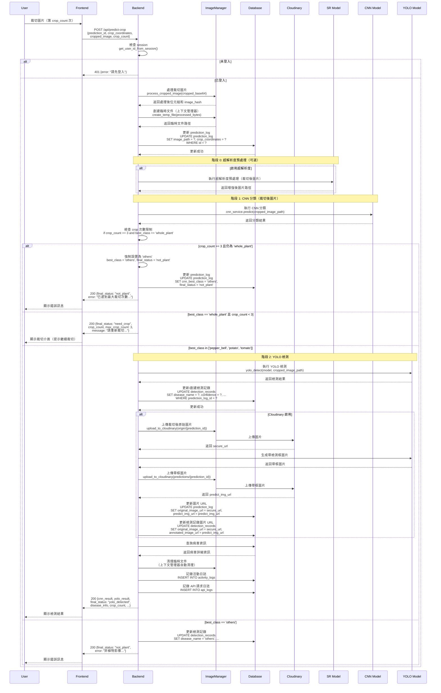

---

## 5. 獲取檢測歷史 (History)

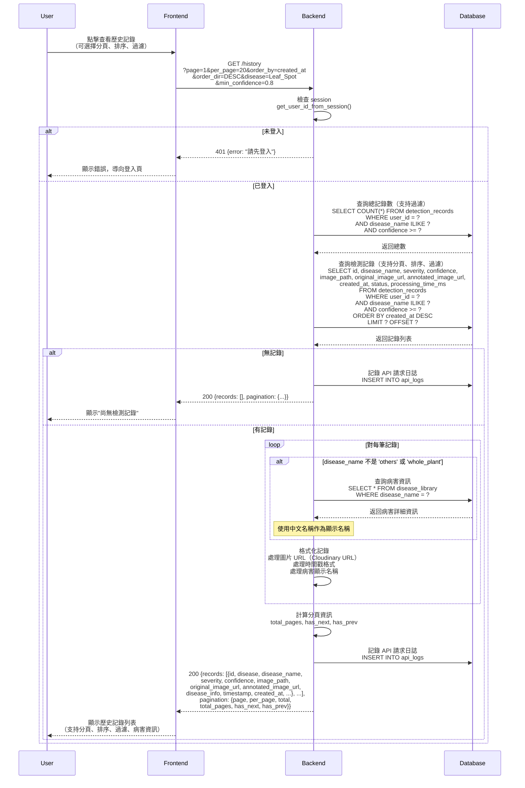

---

## 5.1. 刪除檢測記錄 (Delete History Record)

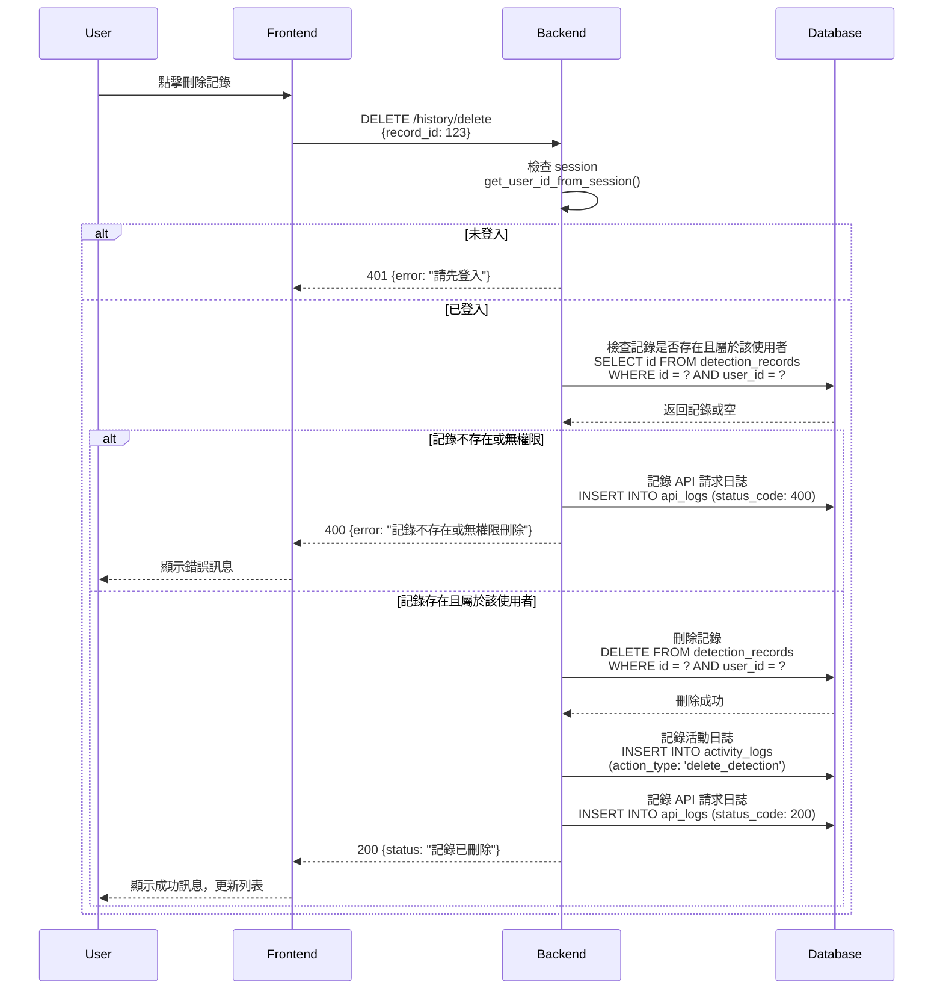

---

## 6. 獲取圖片 (Get Image)

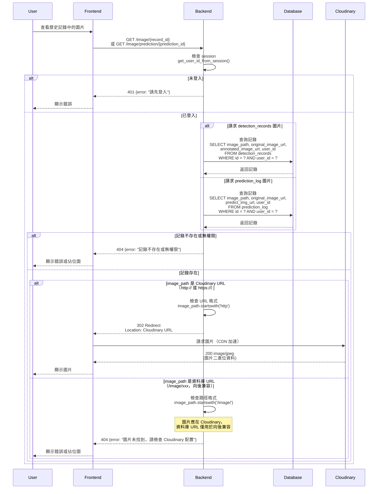

---

## 7. 使用者登出 (Logout)

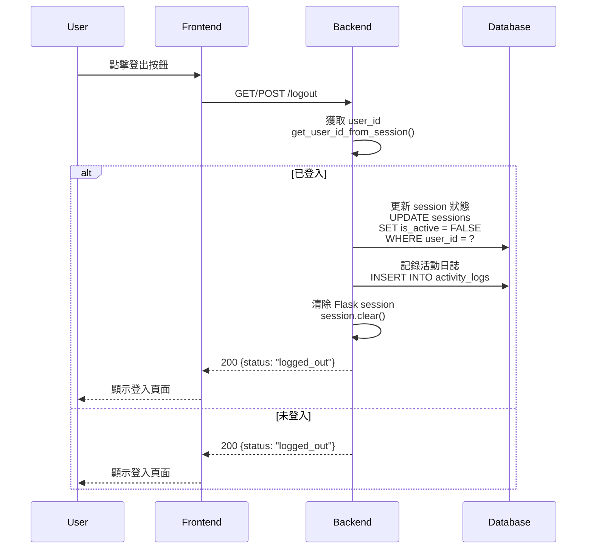

---

## 8. 修改密碼 (Change Password)

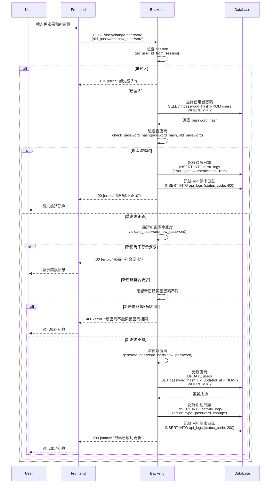

---

## 9. 更新個人資料 (Update Profile)

---

## 10. 獲取使用者統計 (User Stats)

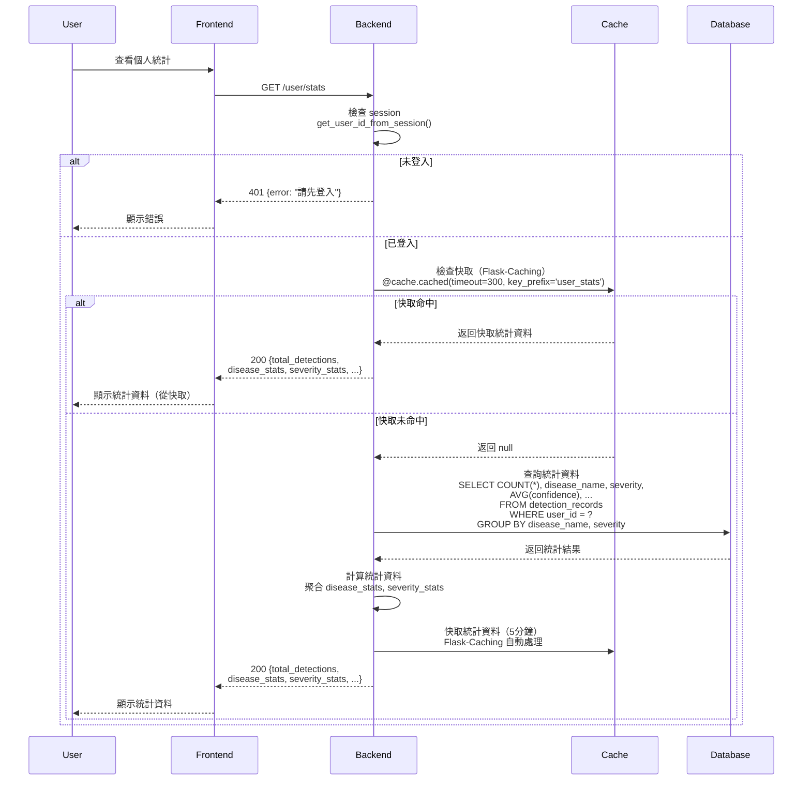

---

## 注意事項

### Redis 快取策略

1. **登入嘗試限制**: `login_attempts:{email}` - 5 分鐘過期
2. **檢測結果快取**: `integrated_detection:{image_hash}:{user_id}` - 1 小時過期
3. **使用者統計快取**: Flask-Caching (`@cache.cached`) - 5 分鐘過期

### 錯誤處理

-   所有 API 請求都會記錄到 `api_logs` 表
-   認證錯誤會記錄到 `error_logs` 表
-   使用者活動會記錄到 `activity_logs` 表

### 圖片存儲

-   **圖片處理流程**：
    -   使用 `ImageManager` 統一管理圖片處理流程
    -   解碼 Base64 圖片資料
    -   驗證圖片格式和大小（最大 5MB）
    -   Resize 到標準尺寸（640x640）
    -   計算 SHA256 hash（用於檢測重複和快取）
-   **臨時文件管理**：
    -   使用上下文管理器 (`create_temp_file()`) 自動管理臨時文件
    -   臨時文件存儲在 `uploads/` 目錄
    -   檢測完成後自動清理（無需手動刪除）
    -   支持自動清理過期暫存文件（預設 24 小時）
-   **Cloudinary 儲存**（如果啟用）：
    -   原始圖片：`leaf_disease_ai/origin/{prediction_id}.jpg`
    -   帶檢測框圖片：`leaf_disease_ai/predictions/{prediction_id}.jpg`
    -   使用 Cloudinary CDN 加速圖片訪問
-   **資料庫儲存**：
    -   資料庫中只存儲圖片 URL（`original_image_url`, `predict_img_url`, `annotated_image_url`）
    -   不存儲圖片二進位資料（節省資料庫空間）
-   **圖片訪問**：
    -   `/image/{record_id}` - 獲取 detection_records 圖片
    -   `/image/prediction/{prediction_id}` - 獲取 prediction_log 圖片
    -   如果是 Cloudinary URL（http:// 或 https://），會重定向到 Cloudinary
    -   如果是資料庫 URL（/image/xxx），會返回錯誤（圖片應在 Cloudinary）

### AI Model 整合

-   CNN、YOLOv11 和超解析度模型在後端啟動時載入
-   **超解析度預處理**（可選）：
    -   如果啟用，在 CNN 分類前先執行超解析度預處理
    -   使用 EDSR 模型，支持 2x、4x、8x 放大
    -   增強圖片解析度以提高檢測準確度
-   **CNN 分類流程**：
    -   先執行 CNN 分類，獲取圖片類別（pepper_bell, potato, tomato, whole_plant, others）
    -   根據分類結果決定是否執行 YOLO 檢測
-   **YOLO 檢測流程**（僅在特定類別時執行）：
    -   調用 `yolo_detect(model, image_path)` 進行檢測
    -   使用 `model.predict().plot(labels=False)` 生成帶檢測框的圖片（不包含文字標籤）
    -   預測結果包含：病害名稱、置信度、邊界框等資訊
-   **整合檢測服務** (`IntegratedDetectionService`) 統一管理整個流程
-   **裁切流程**：
    -   如果 CNN 分類為 `whole_plant`，提示使用者裁切
    -   支持最多 3 次裁切嘗試
    -   第 3 次裁切後仍為 `whole_plant` 時，強制設置為 `others`

### Cloudinary 圖片存儲

-   **配置**：
    -   通過環境變數 `USE_CLOUDINARY` 控制是否啟用
    -   需要配置 `CLOUDINARY_CLOUD_NAME`, `CLOUDINARY_API_KEY`, `CLOUDINARY_API_SECRET`
-   **上傳流程**：
    -   原始圖片在檢測完成後上傳到 `leaf_disease_ai/origin/{prediction_id}.jpg`
    -   帶檢測框圖片在 YOLO 檢測完成後上傳到 `leaf_disease_ai/predictions/{prediction_id}.jpg`
    -   上傳失敗不會中斷檢測流程（記錄警告日誌）
-   **圖片組織結構**：
    -   `leaf_disease_ai/origin/{prediction_id}.jpg` - 原始圖片
    -   `leaf_disease_ai/predictions/{prediction_id}.jpg` - 帶檢測框的圖片
-   **資料庫儲存**：
    -   資料庫中只存儲 Cloudinary URL，不存儲圖片二進位資料
    -   `image_path`, `original_image_url`, `predict_img_url`, `annotated_image_url` 欄位存儲 Cloudinary URL
-   **圖片訪問**：
    -   通過 Cloudinary URL 直接訪問（CDN 加速）
    -   後端會重定向（302）到 Cloudinary URL
    -   如果 Cloudinary 未啟用，則使用本地文件系統（向後兼容，但建議啟用 Cloudinary）

### 歷史記錄查詢功能

-   **分頁支持**：
    -   使用 `page` 和 `per_page` 參數控制分頁
    -   每頁最多 100 筆記錄
    -   返回總記錄數和總頁數
-   **排序支持**：
    -   使用 `order_by` 參數指定排序欄位（created_at, confidence, disease_name, severity）
    -   使用 `order_dir` 參數指定排序方向（ASC, DESC）
-   **過濾支持**：
    -   使用 `disease` 參數過濾病害名稱（不區分大小寫，支持部分匹配）
    -   使用 `min_confidence` 參數過濾最小置信度
-   **病害資訊查詢**：
    -   對每筆記錄自動查詢 `disease_library` 表獲取病害詳細資訊
    -   如果找到中文名稱，使用中文名稱作為顯示名稱
    -   返回完整的病害資訊（包含病因、症狀、防治措施等）
